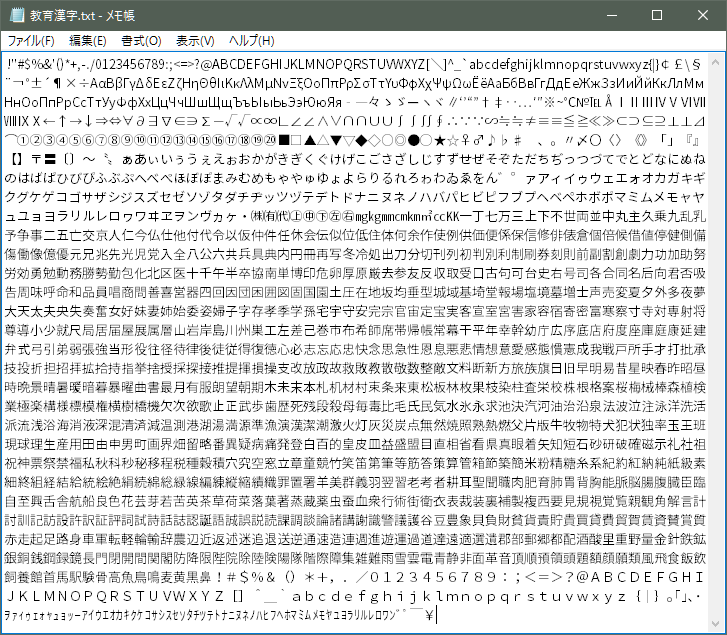
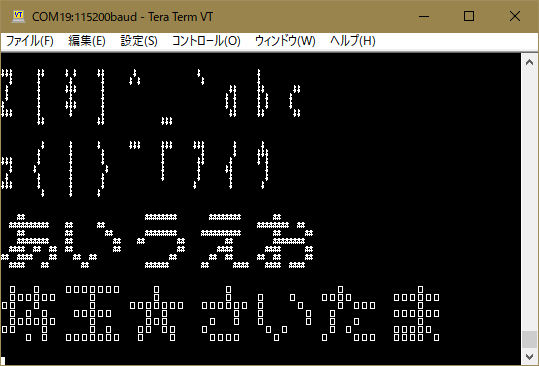

# Arduino-misakiSJIS

Arduino用 美咲フォントライブラリ 教育漢字・内部フラッシュメモリ乗せ版

## 概要

Arduino用の美咲フォントドライバライブラリのシフトJISバージョンです。  
フォントを教育漢字1,006字(小学校で習う漢字）＋ひらがな・カタカナ・記号・半角等の1,710字に絞って  Arduino Uno(Atmega328)のフラッシュメモリ上に格納しました。  

※Arduino IDEでは文字コードにUTF-8を利用しています。スケッチ内で直接日本語を含む文字列を扱いたい場合は、[Arduino-misakiUTF16](https://github.com/Tamakichi/Arduino-misakiUTF16)をお使い下さい。  

収録文字  
  

## 仕様

* 文字コード  シフトJIS  
* フォントデータ  8x8ドッド美咲フォント  
  美咲フォント： <http://www.geocities.jp/littlimi/misaki.htm>  
* 利用可能フォント数  1,710字（Arduinoのフラッシュメモリ上に格納）  
  * 漢字 教育漢字 1,006字(小学校で習う漢字）  
  * 非漢字 全角 546字(全角英数字、ひらがな、かたかな、記号)  
  * 半角フォント  158字(半角記号、半角英数、半角カタカナ）  

## 利用可能API

■ **半角コード(記号英数字、カナ)をSJIS全角コードに変換する**  

* 書式  
`uint16_t HantoZen(uint16_t sjis)`  

* 引数  
`sjis`: 文字コード(IN)  

* 戻り値  
変換したSJIS文字コード  
(指定したコードが全角の場合はそのままコードを返す)  

■ **SJISに対応するフォントデータ(8バイト)取得**  

* 書式  
`boolean getFontDataBySJIS(byte* fontdata, uint16_t sjis)`  

* 引数  
`fontdata`: フォントデータ格納アドレス(OUT)  
`sjis`: SJIS文字コード(IN)  

* 戻り値  
`true`: 正常終了  
`false`: 異常終了  
 対応するフォントが無かった場合、フォントデータとして豆腐（▢）を返す。  

■ **文字列に対応する先頭文字のフォントデータ取得**  

* 書式  
`char* getFontData(byte* fontdata,char *pSJIS,bool h2z=false)`  

* 引数  
`fontdata`: フォントデータ格納アドレス(OUT)  
`pSJIS`: SJIS文字列(IN)  
`h2z`: 半角全角変換指定(IN)  `true`：全角変換あり `false` 全角変換なし(省略時デフォルト)  

* 戻り値  
変換を行った文字の次位置のアドレスを返す(文列末は0x00を指す位置となる).  
取得失敗時はNULLを返す.  

■  **フォントデータテーブル先頭アドレス取得**  

* 書式  
`const uint8_t* getFontTableAddress()`

* 引数  
なし  

* 戻り値  
フォントデータを格納しているデータ領域の先頭アドレスを返す.  
アドレスはフラッシュメモリ領域であるため領域参照は`pgm_read_byte()`を利用する必要がある.  

■ 利用可能フォントの検索  

* 書式  
`int findcode(uint16_t  sjis)`  

* 引数  
`sjis`: SJIS文字コード(IN)  

* 戻り値  
指定したコードに対するフォントコード(0～1709)を返す.  
該当するフォントが存在ししない場合は-1 を返す.  
本関数で取得したコードはフォントデータテーブル上の格納順番を示すコードである.  
フォントの格納アドレスの取得は次の記述で行える.  
`getFontTableAddress()+findcode(sjis)*8`

## サンプルスケッチ

banner  

```CPP
//
// 美咲フォントライブラリサンプルプログラム by たま吉さん
//  2018/01/31 作成
//

#include <misakiSJIS.h>

//
// フォントパターンをコンソールに表示する
// 引数
//  pSJIS 表示する文字列
//  fore  ドットに使用するキャラクタ
//  back  空白に使用するキャラクタ
//
// ※半角文字は全角文字に置き換えを行う
//
void banner(char * pSJIS, char* fore, char* back) {
  int n=0;
  byte buf[20][8];  //160x8ドットのバナー表示パターン

  // バナー用パターン作成
  while(*pSJIS)
    pSJIS = getFontData(&buf[n++][0], pSJIS,0);  // フォントデータの取得

  // バナー表示
  for (byte i=0; i < 8; i++) {
    for (byte j=0; j < n; j++)
        for (byte k=0; k<8;k++)
          Serial.print(bitRead(buf[j][i],7-k) ? fore: back);
    Serial.println();
  }
  Serial.println();
}

void setup() {
  char str[] = {0x7a,0x7b,0x7c,0x7d,0x7e,0xa2,0xb1,0xb2,0xb3,0};// z{|}~｢ｱｲｳ
  Serial.begin(115200);
  banner("Z[\\]^_`abc","$"," ");
  banner(str,"$"," ");
  banner("\x82\xa0\x82\xa2\x82\xa4\x82\xa6\x82\xa8","##","  "); //あいうえお
  banner("\x8d\xe9\x8B\xCA\x81\x99\x82\xB3\x82\xA2\x82\xBD\x82\xDC","[]","  "); // 埼玉☆さいたま  
}

void loop() {
}
```

  
